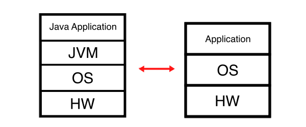
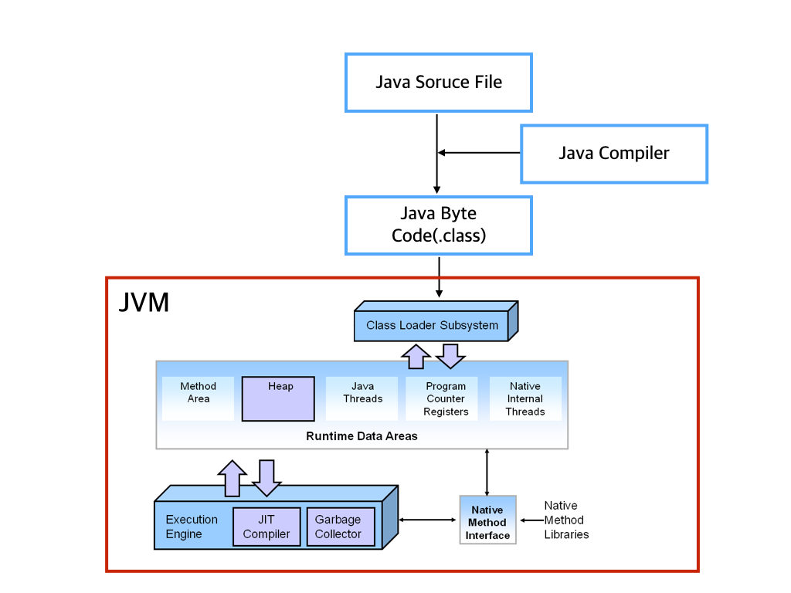

## JVM이란

일반 어플리케이션과 달리 자바 어플리케이션은 JVM이라는 큰 차이가 있다.

JVM(Java Virtual Machine)은 자바의 "Write once, run anywhere"이라는 장점을 가능하게 하는데, 자바 바이트코드로 컴파일 된 모든 프로그램 OS와 상관 없이 독립적으로 실행할 수 있도록 한다.

아래 그림과 같이 일반 어플리케이션은 OS를 거쳐 바로 하드웨어로 코드가 전달되지만, 자바 코드는  JVM을 거쳐 OS, 하드웨어로 전달된다.

JVM은 OS에 맞게 소스 코드를 해석하기 때문에 OS를 고려하지 않아도 되는 것이다.

이러한 구조 덕분에 자바는 OS 종속적이라는 일반 어플리케이션의 한계에서 벗어나 OS 독립적이라는 특징을 갖게 된다.

또한 JVM은 프로그램 메모리를 관리, 최적화 하는 기능도 있다.

출처: [https://youngjinmo.github.io/2021/01/livestudy-week-01/](https://youngjinmo.github.io/2021/01/livestudy-week-01/)

## .java의 전체 실행 과정

1. 개발자가 소스 코드(.java)를 작성하게 되면 이는 자바 컴파일러인 javac에 의해 바이트 코드(.class)로 컴파일 된다.
    - 바이트 코드: JVM이 이해할 수 있는 코드로, OS 종속적이지 않다는 특징을 가지고 있고, VM이 있어야 실행할 수 있다.
2. Class Loader가 바이트 코드를 JVM에 로드한다.
    - 클래스 로더: 클래스를 JVM 메모리에 로드하는데, 이미 클래스가 로드 되었는지를 확인하여 로딩이 되어 있다면 캐싱된 값을 리턴하고 로드되지 않았으면 클래스를 로드한다.
3. 해석된 바이트 코드는 JIT 컴파일러를 거치며 기계어로 번역되어 실행된다.
    - JIT 컴파일러: 자바는 다른 언어와 달리 JVM이 중간에서 해석하는 과정을 한 단계 더 거치기 때문에 속도가 느렸지만 JIT 컴파일러를 통해 속도 이슈를 극복하였다. 코드가 실행되는 실시간에 기계어로 번역을 하기 때문에  속도가 빠르고 변환된 코드를 캐싱하여 재사용한다.

출처: [https://medium.com/@lazysoul/jvm-이란-c142b01571f2](https://medium.com/@lazysoul/jvm-%EC%9D%B4%EB%9E%80-c142b01571f2)

- 참고

자바의 정석 Chapter 1